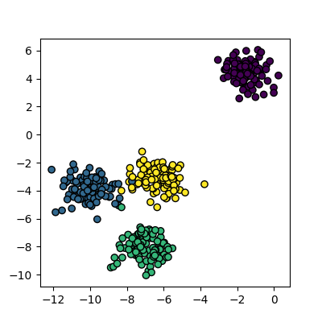
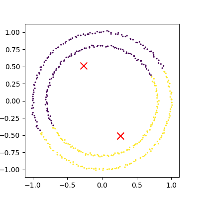
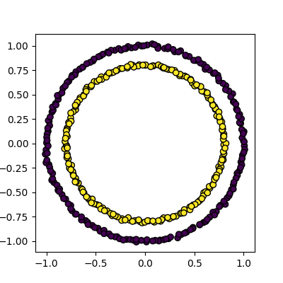

# Unsupervised learning

In episode 2 we learnt about supervised learning. Now it is time to explore unsupervised learning. 

Sometimes we do not have the luxury of using labelled data. This could be for a number of reasons:

* We have labelled data, but not enough to accurately train our model
* Our existing labelled data is low-quality or innacurate
* It is too time-consuming to (manually) label more data
* We have data, but no idea what correlations might exist that we could model!

In this case we need to use unsupervised learning. As the name suggests, this time we do not "supervise" the ML algorithm by providing it labels, but instead we let it try to find its own patterns in the data and report back on any correlations that it might find. You can think of unsupervised learning as a way to discover labels from the data itself.

# Clustering

Clustering is the grouping of data points which are similar to each other. It can be a powerful technique for identifying patterns in data.
Clustering analysis does not usually require any training and is therefore known as an unsupervised learning technique. Clustering can be applied quickly due to this lack of training.

## Applications of clustering
* Looking for trends in data
* Reducing the data around a point to just that point (e.g. reducing colour depth in an image)
* Pattern recognition

## K-means clustering

The k-means clustering algorithm is a simple clustering algorithm that tries to identify the centre of each cluster.
It does this by searching for a point which minimises the distance between the centre and all the points in the cluster.
The algorithm needs to be told how many k clusters to look for, but a common technique is to try different numbers of clusters and combine
it with other tests to decide on the best combination. 

> ## Hyper-parameters again
> 'K' is also an exmaple of a *hyper-parameter* for the k-means clustering technique. Another example of a hyper-parameter is the N-degrees of freedom for polynomial regression. Keep an eye out for others throughout the lesson!
{: .callout}

### K-means with Scikit-Learn

To perform a k-means clustering with Scikit-Learn we first need to import the sklearn.cluster module.

~~~
import sklearn.cluster as skl_cluster
~~~
{: .language-python}

For this example, we're going to use Scikit-Learn's built-in 'random data blob generator' instead of using an external dataset. Therefore we'll need the `sklearn.datasets.samples_generator` module.

~~~
import sklearn.datasets as skl_datasets
~~~
{: .language-python}

Now lets create some random blobs using the `make_blobs` function. The `n_samples` argument sets how many points we want to use in all of our blobs while `cluster_std` sets the standard deviation of the points. The smaller this value the closer together they will be. `centers` sets how many clusters we'd like. `random_state` is the initial state of the random number generator. By specifying this value we'll get the same results every time we run the program. If we don't specify a random state then we'll get different points every time we run. This function returns two things: an array of data points and a list of which cluster each point belongs to.

~~~
import matplotlib.pyplot as plt

#Lets define some functions here to avoid repetitive code
def plots_labels(data, labels):
    tx = data[:, 0]
    ty = data[:, 1]

    fig = plt.figure(1, figsize=(4, 4))
    plt.scatter(tx, ty, edgecolor='k', c=labels)
    plt.show()

def plot_clusters(data, clusters, Kmean):
    tx = data[:, 0]
    ty = data[:, 1]
    fig = plt.figure(1, figsize=(4, 4))
    plt.scatter(tx, ty, s=5, linewidth=0, c=clusters)
    for cluster_x, cluster_y in Kmean.cluster_centers_:
        plt.scatter(cluster_x, cluster_y, s=100, c='r', marker='x')
    plt.show()
~~~
{: .language-python}

Lets create the clusters.

~~~
data, cluster_id = skl_datasets.make_blobs(n_samples=400, cluster_std=0.75, centers=4, random_state=1)
plots_labels(data, cluster_id)
~~~
{: .language-python}

Now that we have some data we can try to identify the clusters using k-means. First, we need to initialise the KMeans module and tell it how many clusters to look for. Next, we supply it with some data via the `fit` function, in much the same way we did with the regression functions earlier on. Finally, we run the predict function to find the clusters.

~~~
Kmean = skl_cluster.KMeans(n_clusters=4)
Kmean.fit(data)
clusters = Kmean.predict(data)
~~~
{: .language-python}

The data can now be plotted to show all the points we randomly generated. To make it clearer which cluster points have been classified we can set the colours (the c parameter) to use the `clusters` list that was returned by the `predict` function. The Kmeans algorithm also lets us know where it identified the centre of each cluster. These are stored as a list called 'cluster_centers_' inside the `Kmean` object. Let's plot the points from the clusters, colouring them by the output from the K-means algorithm, and also plot the centres of each cluster as a red X.

~~~
plot_clusters(data, clusters, Kmean)
~~~
{: .language-python}

Here is the code all in a single block.

~~~
import sklearn.cluster as skl_cluster
import sklearn.datasets as skl_datasets
import matplotlib.pyplot as plt

data, cluster_id = skl_datasets.make_blobs(n_samples=400, cluster_std=0.75, centers=4, random_state=1)

Kmean = skl_cluster.KMeans(n_clusters=4)
Kmean.fit(data)
clusters = Kmean.predict(data)

plot_clusters(data, clusters, Kmean)
~~~
{: .language-python}

> ## Working in multiple dimensions
> Although this example shows two dimensions, the kmeans algorithm can work in more than two. It becomes very difficult to show this visually
> once we get beyond 3 dimensions. Its very common in machine learning to be working with multiple variables and so our classifiers are working in
> multi-dimensional spaces.
{: .callout}

### Limitations of k-means

* Requires number of clusters to be known in advance
* Struggles when clusters have irregular shapes
* Will always produce an answer finding the required number of clusters even if the data isn't clustered (or clustered in that many clusters)
* Requires linear cluster boundaries

### Advantages of k-means

* Simple algorithm and fast to compute
* A good choice as the first thing to try when attempting to cluster data
* Suitable for large datasets due to its low memory and computing requirements

> ## Exercise: K-Means with overlapping clusters
> Adjust the program above to increase the standard deviation of the blobs (the cluster_std parameter to make_blobs) and increase the number of samples (n_samples) to 4000.
> You should start to see the clusters overlapping.
> Do the clusters that are identified make sense?
> Is there any strange behaviour?
>
> > ## Solution
> > Increasing n_samples to 4000 and cluster_std to 3.0 looks like this:
> > 
> > The straight line boundaries between clusters look a bit strange.
> {: .solution}
{: .challenge}

> ## Exercise: How many clusters should we look for?
> Using k-means requires us to specify the number of clusters to expect. A common strategy to get around this is to vary the number of clusters we are looking for.
> Modify the program to loop through searching for between 2 and 10 clusters. Which (if any) of the results look more sensible? What criteria might you use to select the best one?
> > ## Solution
> > ~~~
> > for cluster_count in range(2,11):
> >     Kmean = skl_cluster.KMeans(n_clusters=cluster_count)
> >     Kmean.fit(data)
> >     clusters = Kmean.predict(data)
> >     plt.scatter(data[:, 0], data[:, 1], s=5, linewidth=0,c=clusters)
> >     for cluster_x, cluster_y in Kmean.cluster_centers_:
> >         plt.scatter(cluster_x, cluster_y, s=100, c='r', marker='x')
> >         # give the graph a title with the number of clusters
> >         plt.title(str(cluster_count)+" Clusters")
> >     plt.show()
> > ~~~
> > {: .language-python}
> >
> > None of these look like very sensible clusterings because all of the points form one large cluster.
> > We might look at a measure of similarity to test if this single cluster is actually multiple clusters. A simple standard deviation or interquartile range might be a good starting point.
> {: .solution}
{: .challenge}

## Spectral clustering

Spectral clustering is a technique that attempts to overcome the linear boundary problem of k-means clustering.
It works by treating clustering as a graph partitioning problem and looks for nodes in a graph with a small distance between them. See [this](https://www.cvl.isy.liu.se/education/graduate/spectral-clustering/SC_course_part1.pdf) introduction to spectral clustering if you are interested in more details about how spectral clustering works.

Here is an example of spectral clustering on two concentric circles:

Spectral clustering uses something called a 'kernel trick' to introduce additional dimensions to the data.
A common example of this is trying to cluster one circle within another (concentric circles).
A k-means classifier will fail to do this and will end up effectively drawing a line which crosses the circles.
However spectral clustering will introduce an additional dimension that effectively moves one of the circles away from the other in the
additional dimension. This does have the downside of being more computationally expensive than k-means clustering.

### Spectral clustering with Scikit-Learn

Lets try out using Scikit-Learn's spectral clustering. To make the concentric circles in the above example we need to use the `make_circles` function in the sklearn.datasets module. This works in a very similar way to the make_blobs function we used earlier on.

~~~
import sklearn.datasets as skl_data

circles, circles_clusters = skl_data.make_circles(n_samples=400, noise=.01, random_state=0)
plots_labels(circles, circles_clusters)
~~~
{: .language-python}

The code for calculating the SpectralClustering is very similar to the kmeans clustering, but instead of using the sklearn.cluster.KMeans class we use the `sklearn.cluster.SpectralClustering` class.
~~~
model = skl_cluster.SpectralClustering(n_clusters=2, affinity='nearest_neighbors', assign_labels='kmeans')
~~~
{: .language-python}

The SpectralClustering class combines the fit and predict functions into a single function called fit_predict.

~~~
labels = model.fit_predict(circles)
plots_labels(circles, labels)
~~~
{: .language-python}

Here is the whole program combined with the kmeans clustering for comparison. Note that this produces two figures. To view both of them use the "Inline" graphics terminal inside the Python console instead of the "Automatic" method which will open a window and only show you one of the graphs.

~~~
import sklearn.cluster as skl_cluster
import sklearn.datasets as skl_data

circles, circles_clusters = skl_data.make_circles(n_samples=400, noise=.01, random_state=0)

# cluster with kmeans
Kmean = skl_cluster.KMeans(n_clusters=2)
Kmean.fit(circles)
clusters = Kmean.predict(circles)

# plot the data, colouring it by cluster
plot_clusters(circles, clusters, Kmean)

# cluster with spectral clustering
model = skl_cluster.SpectralClustering(n_clusters=2, affinity='nearest_neighbors', assign_labels='kmeans')
labels = model.fit_predict(circles)
plots_labels(circles, labels)
~~~
{: .language-python}

> ## Comparing k-means and spectral clustering performance
> Modify the program we wrote in the previous exercise to use spectral clustering instead of k-means and save it as a new file.
> Time how long both programs take to run. Add the line `import time` at the top of both files as the first line, and get the start time with `start_time = time.time()`.
> End the program by getting the time again and subtracting the start time from it to get the total run time. Add `end_time = time.time()` and `print("Elapsed time:",end_time-start_time,"seconds")` to the end of both files.
> Compare how long both programs take to run generating 4,000 samples and testing them for between 2 and 10 clusters.
> How much did your run times differ?
> How much do they differ if you increase the number of samples to 8,000?
> How long do you think it would take to compute 800,000 samples (estimate this, it might take a while to run for real)?
> > ## Solution
> > KMeans version: runtime around 4 seconds (your computer might be faster/slower)
> > ~~~
> > import matplotlib.pyplot as plt
> > import sklearn.cluster as skl_cluster
> > from sklearn.datasets import make_blobs 
> > import time
> >
> > start_time = time.time()
> > data, cluster_id = make_blobs(n_samples=4000, cluster_std=3,
> >                                        centers=4, random_state=1)
> >
> > for cluster_count in range(2,11):
> >     Kmean = skl_cluster.KMeans(n_clusters=cluster_count)
> >     Kmean.fit(data)
> >     clusters = Kmean.predict(data)
> >
> >     plt.scatter(data[:, 0], data[:, 1], s=15, linewidth=0, c=clusters)
> >     plt.title(str(cluster_count)+" Clusters")
> > 
> > plt.show()
> >
> > end_time = time.time()
> > print("Elapsed time = ", end_time-start_time, "seconds")
> > ~~~
> > {: .language-python}
> >
> > Spectral version: runtime around 9 seconds (your computer might be faster/slower)
> > ~~~
> > import matplotlib.pyplot as plt
> > import sklearn.cluster as skl_cluster
> > from sklearn.datasets import make_blobs 
> > import time
> > 
> > start_time = time.time()
> > data, cluster_id = make_blobs(n_samples=4000, cluster_std=3,
> >                                        centers=4, random_state=1)
> >
> > for cluster_count in range(2,11):
> >     model = skl_cluster.SpectralClustering(n_clusters=cluster_count,
> >                                        affinity='nearest_neighbors',
> >                                        assign_labels='kmeans')
> >     labels = model.fit_predict(data)
> >     
> >     plt.scatter(data[:, 0], data[:, 1], s=15, linewidth=0, c=labels)
> >     plt.title(str(cluster_count)+" Clusters")
> > plt.show()
> > end_time = time.time()
> > print("Elapsed time = ", end_time-start_time, "seconds")
> > ~~~
> > {: .language-python}
> >
> > When the number of points increases to 8000 the runtimes are 24 seconds for the spectral version and 5.6 seconds for kmeans.
> > The runtime numbers will differ depending on the speed of your computer, but the relative difference should be similar.
> > For 4000 points kmeans took 4 seconds, while spectral took 9 seconds. A 2.25 fold difference.
> > For 8000 points kmeans took 5.6 seconds, while spectral took 24 seconds. A 4.28 fold difference. Kmeans is 1.4 times slower for double the data, while spectral is 2.6 times slower.
> > The realative difference is diverging. If we used 100 times more data we might expect a 100 fold divergence in execution times.
> > Kmeans might take a few minutes while spectral will take hours.
> {: .solution}
{: .challenge}


